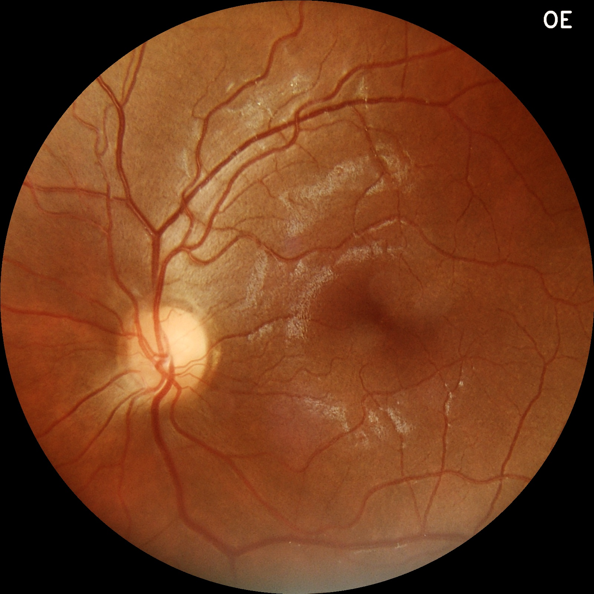
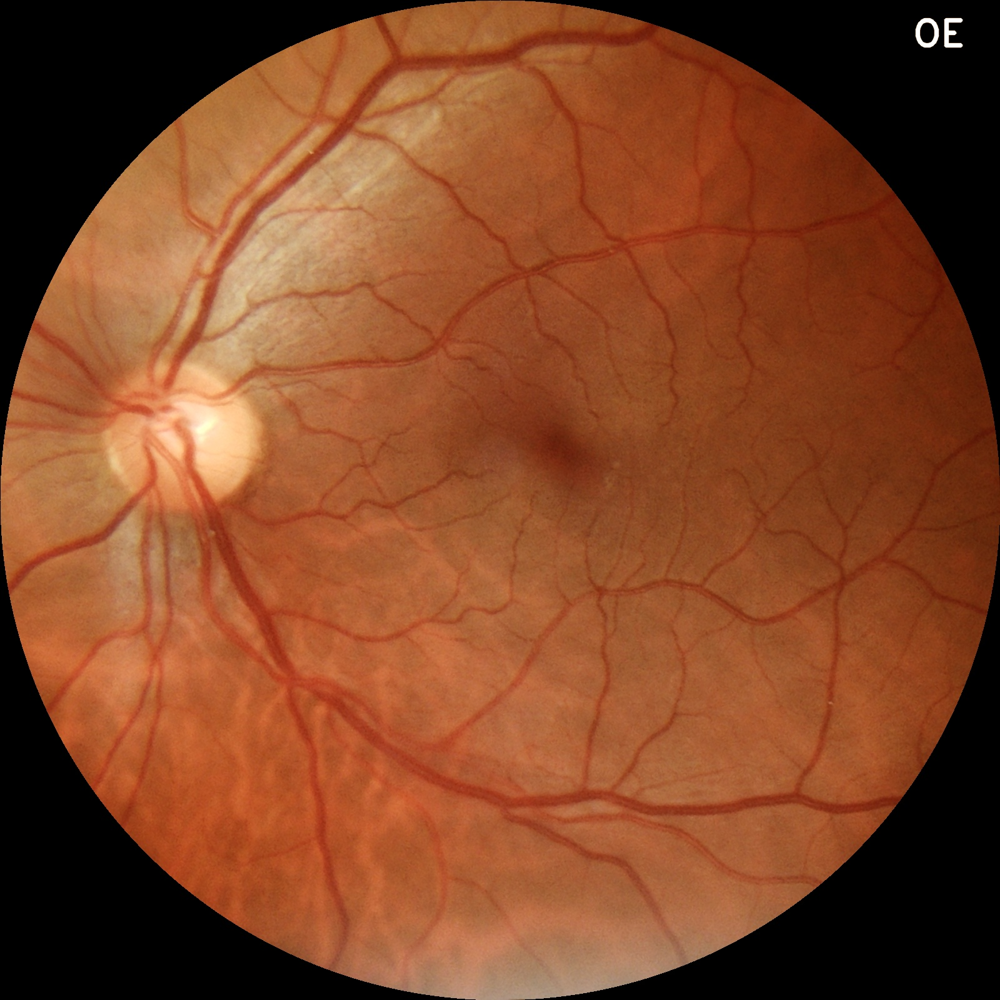
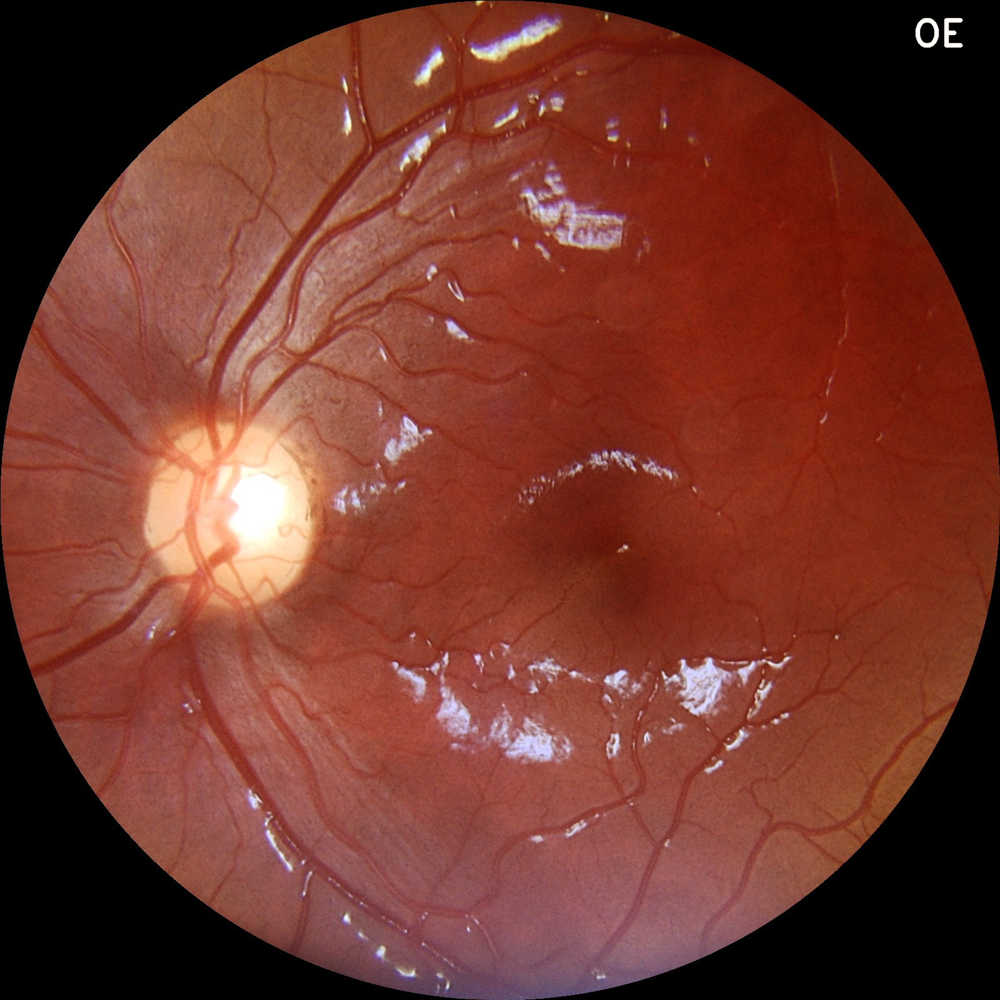
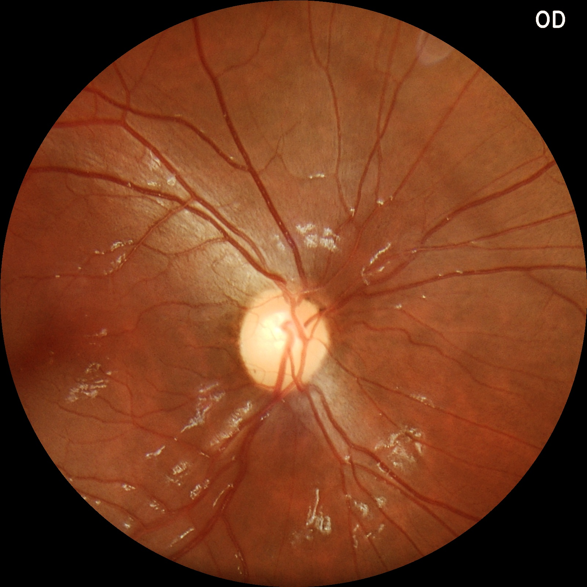
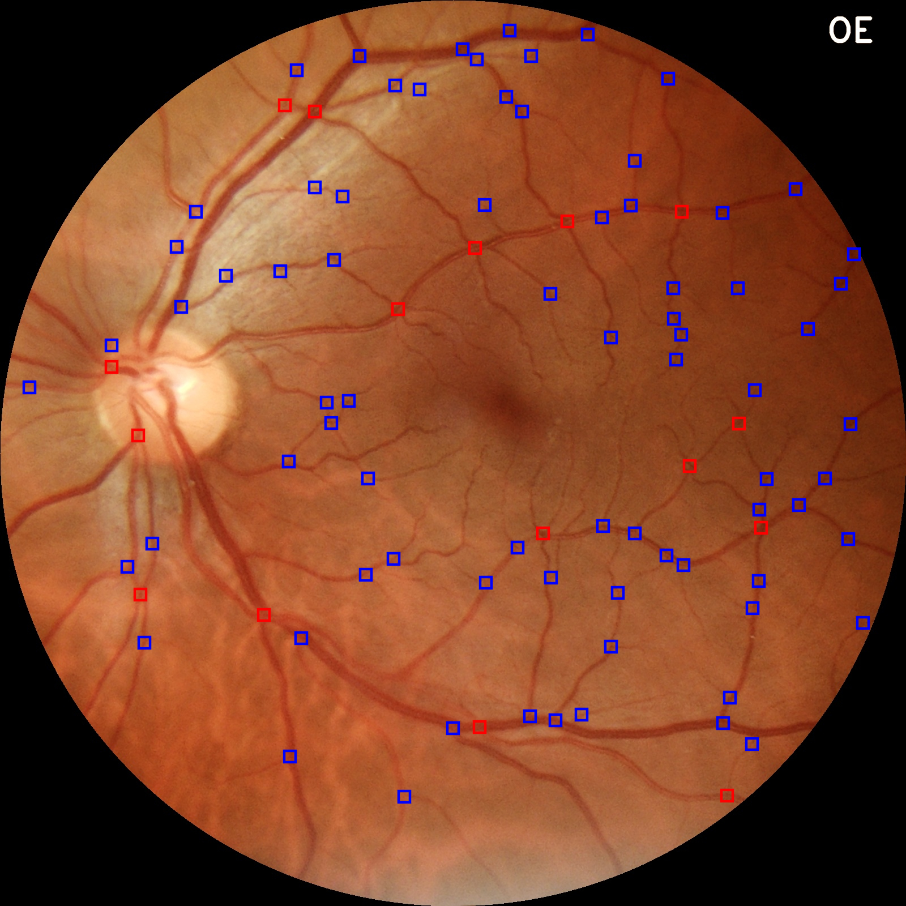

# Uso de Segmentação de Imagens para Identificação de Bifurcações em Vasos Sanguíneos em Imagens de Retina

* Daniel Sá Barretto Prado Garcia 10374344
* Alexandre Galocha Pinto Jr 10734706

## Resumo do projeto
### Objetivo
O projeto busca identificar bifurcações de vasos sanguíneos em imagens de exames 
de retina para auxiliar o diagnóstico de doenças como glaucoma e diabetes. A
ideia principal é processar as imagens de exames de retina para obter imagens
com maior facilidade de identificação de bifurcação nos vasos sanguíneos e a 
partir dessas imagens processadas, calcular as bifurcações.

### Métodos a serem utilizados
O projeto utilizará segmentação de imagem para identificar os vasos sanguíneos e, em seguida, suas bifurcações. Também serão utilizadas técnicas de filtragem e morfológicas para remoção de ruído e correção de cores e sombras. 

### Exemplos de imagens a serem utilizadas
As imagens utilizadas como entrada para o processamento são de exames de retina
(retinografia) obtidas no site da empresa [Phelcom](https://phelcom.com) 
(importante evidenciar que um dos membros da dupla atualmente trabalha na 
empresa e pediu permissão pra uso das imagens). Nessas imagens é possível ver a 
retina do olho com todos os seus vasos sanguíneos e as respectivas bifurcações. 

Exemplos de imagens de entrada podem ser vistos abaixo:

### Descrição das Etapas
Algumas das etapas realizadas foram:
1. Processamento inicial
    * Primeiramente foi separado o canal verde da imagem já que é o que mais possui informação sobre os vasos sanguíneos.
    * Em seguida, realiza-se uma operação de *opening* da imagem para remover certas reflexões.
    * O *background* da imagem é calculado com a aplicação sequêncial dos filtros de média, mediana e gaussiano com diferentes tamanhos de *kernel* sobre a imagem que sofreu a operação de *opening*.
    * Subtrai-se então o *background* da imagem de *opening*, afim de obter uma imagem resultante que trouxesse apenas os vasos sanguíneos (ou linhas no geral, por exemplo o contorno do olho). Finalmente é realizado uma equalização de histograma a fim de realçar os vasos e destacá-los em relação ao ruído no fundo do olho
2. Segmentação
    * O processo de segmentação foi realizado por meio de um *threshold* adaptativo gaussiano, que visa trazer uma imagem mais pura, mostrando apenas os vasos. Mesmo assim, a imagem ainda apresenta ruído
3. Pós-Processamento
    
    * Com auxílio da biblioteca *skimage*, foi possível identificar as regiões conectadas da imagem. Deste modo foi possível filtrar estas regiões pela área total e montar uma imagem com menos ruído. 
    * Foram realizadas operações morfológicas como abertura e erosão da imagem a fim de obter uma imagem com menos ruído, o que se mostrou bastante promissor, uma vez que removeu bastante ruído sem perca de muita informação dos vasos.

Exemplo de imagem de saída

Na imagem acima, as bifurcações são marcadas com quadrados azuis e as intersecções de vasos são marcadas com quadrados vermelhos.